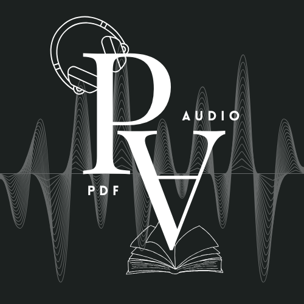

## Logo Preview

# PDF to Audio Converter

A full-stack web application that converts PDF documents into audio using text-to-speech technology.

---

## Features

- Upload PDF files  
- Extract text from PDF  
- Convert text to audio  
- Real-time progress updates (WebSockets)  
- Voice selection (Male / Female)  
- Speed control  
- Download generated audio  
- Conversion history dashboard  

---

## Tech Stack

- Frontend: React + Tailwind CSS  
- Backend: FastAPI  
- Database: SQLite + SQLAlchemy  
- PDF Processing: PyPDF2  
- Text-to-Speech: pyttsx3  
- Communication: WebSockets  

---

## Project Structure

PDF-to-Audio-Converter/
│
├── backend/
│   ├── main.py
│   ├── database.py
│   ├── models.py
│   └── app.db
│
├── frontend/
│   ├── src/
│   └── public/

---

## Run Locally

### Backend

cd backend  
uvicorn main:app --reload  

---

### Frontend

cd frontend  
npm install  
npm start  

---

## Current Status

- Core functionality completed  
- UI improvements in progress  
- Advanced features under development  

---

## Future Improvements

- AI human-like voice  
- Streaming audio playback  
- User authentication system  
- Cloud deployment (AWS / Firebase)  
- Advanced dashboard  

---

## Key Highlights

- Real-time processing using WebSockets  
- FastAPI backend architecture  
- Database integration using SQLAlchemy  
- Modern UI with React + Tailwind CSS  

---

## Contributing

Feel free to fork this repository and submit pull requests.

---

## License

This project is open-source and available under the MIT License.
